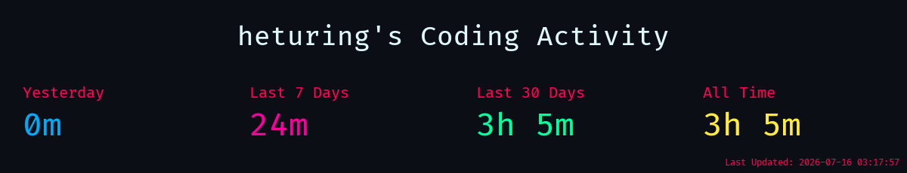
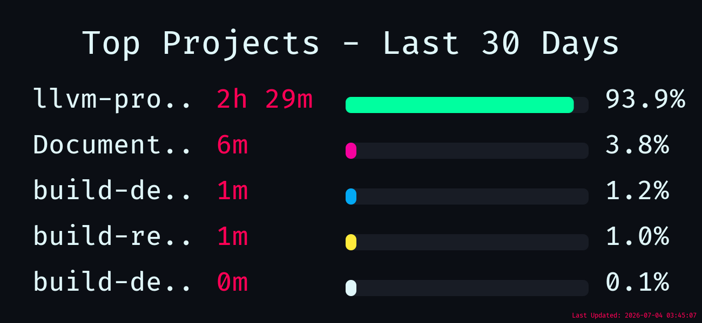
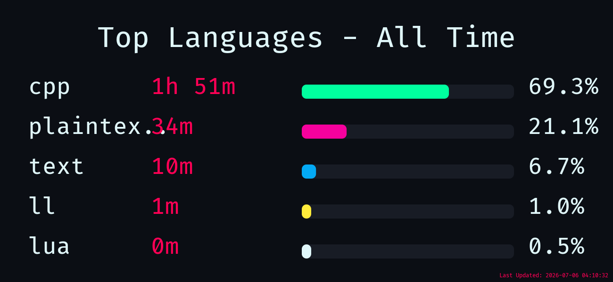
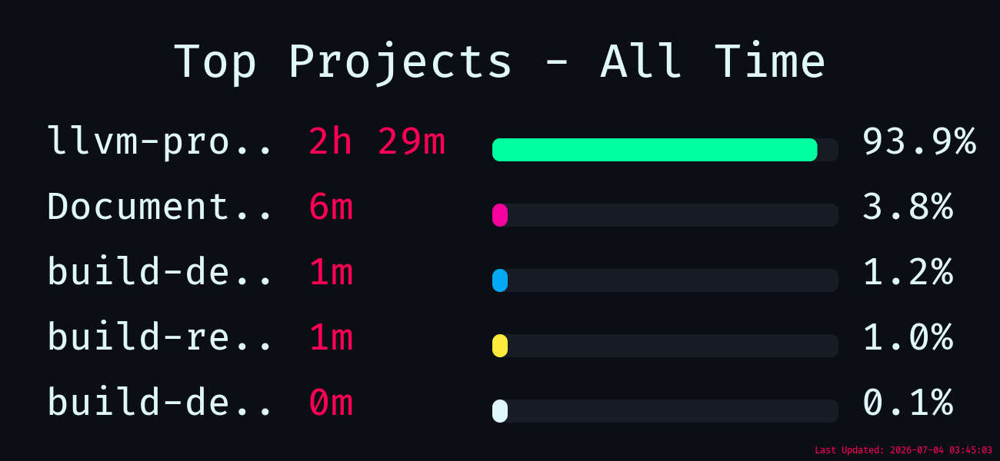
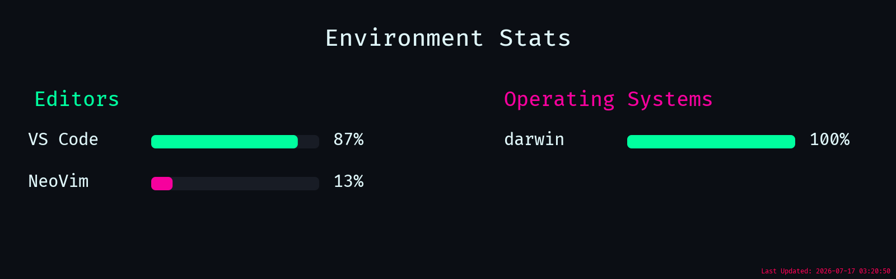

<h1 align="center">Jiaqi He</h1>

  <b>Compiler Infrastructure · Static Analysis · LLVM · Scalable Pointer Analysis</b>

  
  
  
  

I work on scalable and precise static analysis for C/C++ programs, with a focus on pointer analysis, compiler infrastructure, and GPU-accelerated program analysis.

## Current Focus

- LLVM/Clang bug fixing and feature work
- Flow-sensitive pointer analysis for C/C++ programs
- GPU-accelerated static analysis
- Compiler infrastructure and program optimization

## Coding Activity

<!--takatime-start-->

   
  
   
  
   
  

<em>Generated automatically by <a href="https://github.com/Rtarun3606k/TakaTime">TakaTime</a></em>

<!--takatime-end-->

## GitHub Overview

  

  
  

## Recent GitHub Activity

  

## GitHub Stats

  

<!--
**heturing/heturing** is a ✨ _special_ ✨ repository because its `README.md` (this file) appears on your GitHub profile.

Here are some ideas to get you started:

- 🔭 I’m currently working on ...
- 🌱 I’m currently learning ...
- 👯 I’m looking to collaborate on ...
- 🤔 I’m looking for help with ...
- 💬 Ask me about ...
- 📫 How to reach me: ...
- 😄 Pronouns: ...
- ⚡ Fun fact: ...
-->
